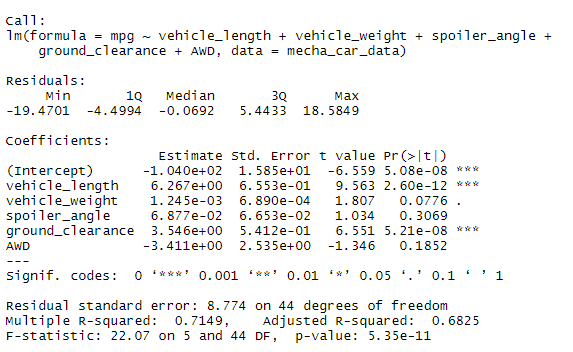
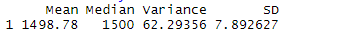
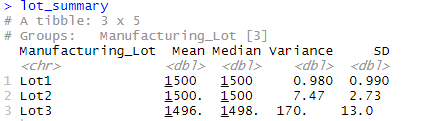
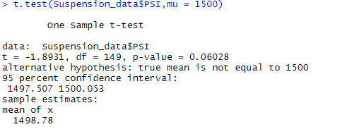
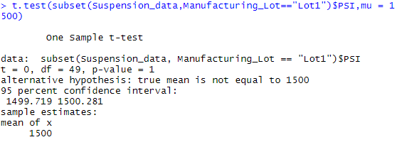
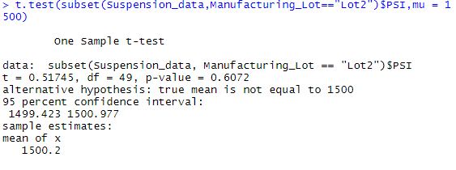
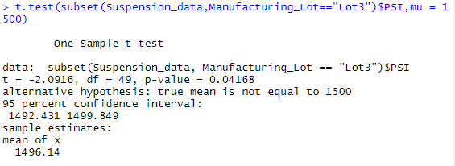

# MechaCar_Statistical_Analysis

## Linear Regression to Predict MPG

From the Pr(>|t|) values, it can be determined that vehicle length and ground clearnace provide a non-random amount of variance. The slope of the linear model is not considered to be zero since the p-value is so small. Thus the data is unlikely to fall under the null hypothesis and the slope must have value. The linear model predicts the mpg effectively as determined by the R-squared value. The r-squared value is 0.7149 which means the model will correcly represent about 71 percent of the data. 

### Total Summary

### Lot Summary

From the lot summary, Lot 1 and Lot 2 both have a mean and median of 1500. Lot 3 has a slightly lower mean and median with 1496 and 1498 respectively. In our given situation, the variance in the suspension coils must not exceed 100. Lot 1 and 2 meet this restriction while Lot 3 does not. In the total summary, the variance is 62 and thus the total data meets the restriction of having a variance less than 100. 

Lot 1 and Lot 2 have high t-values which means there is not a high difference between the overall population means and the means of the individual lots. Lot 3 has a low p value so there is a greater significance of observed difference between population mean and mean of Lot 3.

## Study Design: MechaCar vs Competition
When driving to work, to home, or to trips that take place everyday, the safety features of a car are prioiritized over other features such as horsepower or cost even. For luxury driving, safety may not be the top priority, but the majority of car drivers do not drive for the purpose of racing or having fun. Therefore, choosing a car with the best safety ratings is a desired feature for most car consumers. When comparing the safety rating of a single car to every other car, the null hypothesis states that that specific car has no difference in safety rating than the rest of the cars. Thus the car is not better in terms of safety. The alternative test concludes that there is a difference between the safety rating of that specific car. To compare this one feature to all cars, the one-sided t-test would be used. This would determine if there is a difference from a single object to all other objects in that category in the data set. To perform this test, data of the safety ratings would be needed from the car being observed and the ratings of all other cars in the search. 

